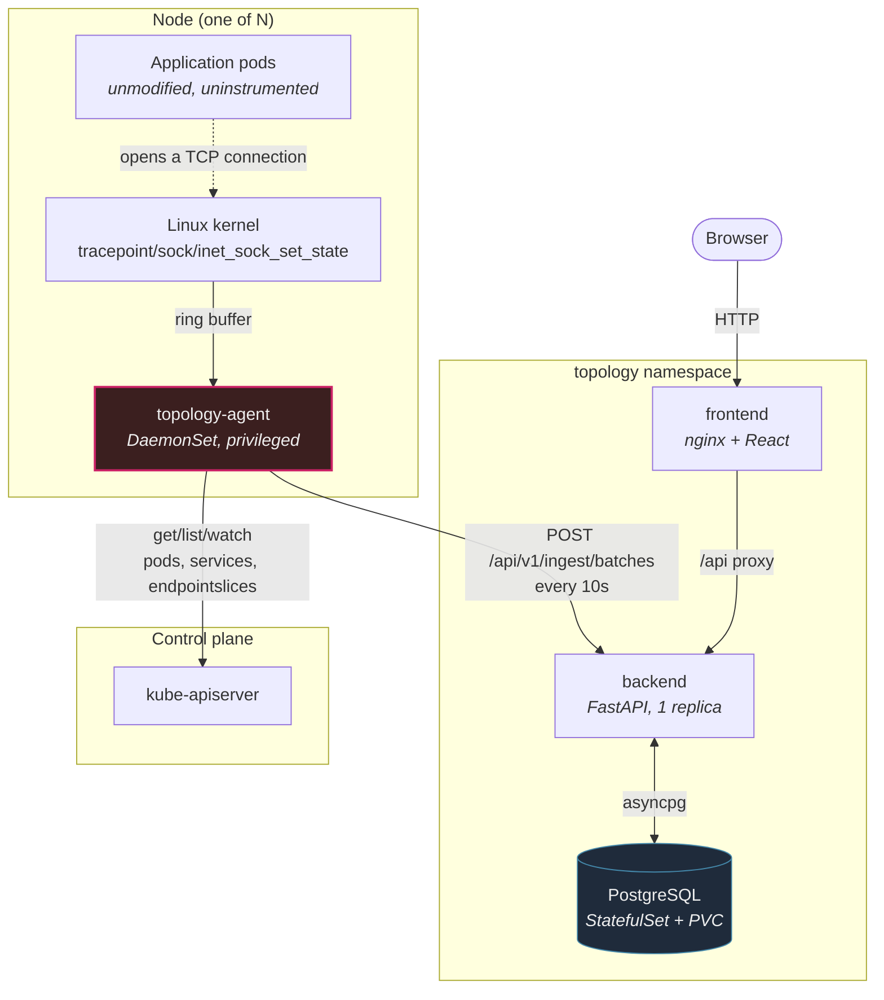
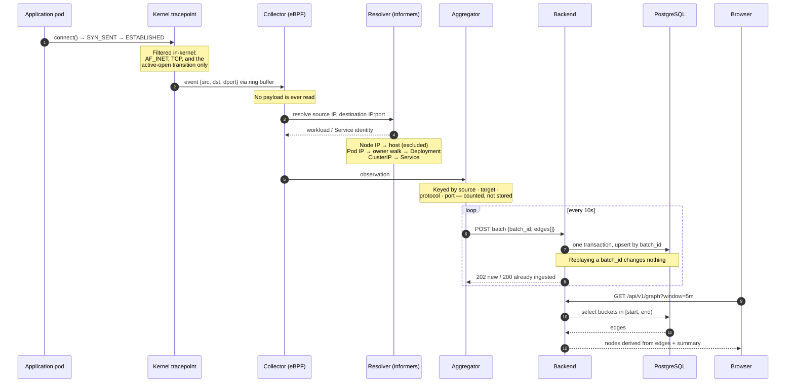
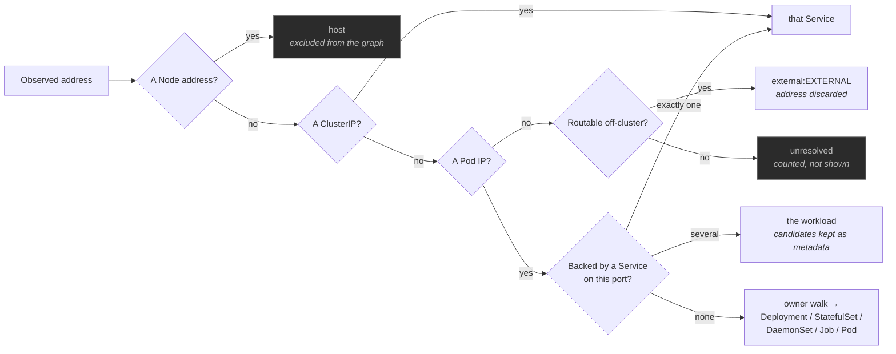
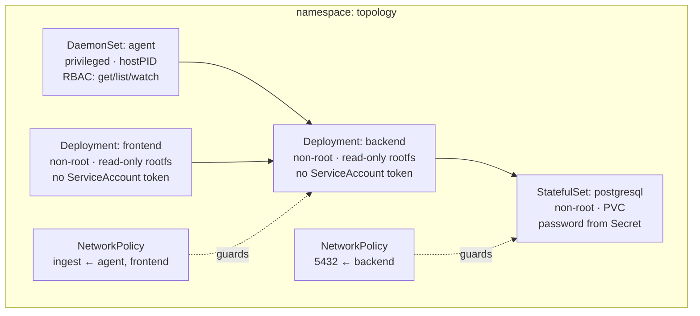

# Architecture

How a TCP connection inside the cluster becomes an edge on a screen, and why each boundary is
where it is.

Design decisions live in `docs/adr/`; this describes what was built. Measured limits are in
[`limitations.md`](limitations.md).

---

## The system

The agent is the only privileged component and the only one that touches the kernel. It holds no
database credentials and its Kubernetes access is read-only. Everything downstream of it works with
already-resolved workload identities, never raw addresses.

## From a connection to an edge

The two properties worth following through that diagram:

**Filtering happens as early as possible.** The four-condition check runs in the kernel, so a pod
receiving a connection never produces an event at all — which is why the graph shows no false
reverse edges. Payload is never read anywhere in the path.

**Identity is resolved at the edge, not in the database.** By the time an observation leaves the
agent it names a Deployment or a Service, never an IP. External traffic has already collapsed to a
single `EXTERNAL` node, so no individual external address is ever transmitted or stored.

## Where identity comes from

Two rules in that ladder exist because of specific failures:

**Node addresses are checked first.** Every host-network pod carries the node's address as its
PodIP — on a control-plane node that is etcd, kube-apiserver, kube-scheduler, kube-proxy and the CNI
agent all at once, plus the kubelet. Looking that address up in the pod cache returns an arbitrary
one of them, which produced edges like `etcd → coredns:8080`. A node address identifies the node,
not a process on it.

**Ambiguity is preserved.** Where several Services select the same pod and port, the result is the
workload with the candidates as metadata — not a guess.

## Why these boundaries

| boundary | reason |
|---|---|
| kernel filter before userspace | an event never created costs nothing to discard, and the active-open condition is what prevents false reverse edges |
| identity resolved in the agent | the backend never sees an IP, so no address can leak into storage or an API response |
| aggregation before delivery | one edge per 10s interval instead of one message per connection |
| `batch_id` idempotency | a retried delivery cannot double-count, which is what makes at-least-once delivery safe |
| one-minute buckets in the domain layer | the in-memory and PostgreSQL adapters produce identical buckets, so the contract suite can run against both |
| nodes derived from edges at query time | a node cannot appear in a window where it had no traffic |

## Deployment shape

Exactly one workload is privileged, and the chart asserts that. The backend and frontend mount no
ServiceAccount token at all. NetworkPolicies are on by default and were verified under Calico —
kind's default CNI ignores them, which is why they are off in the kind demo values rather than
implying a protection that cluster does not provide.
