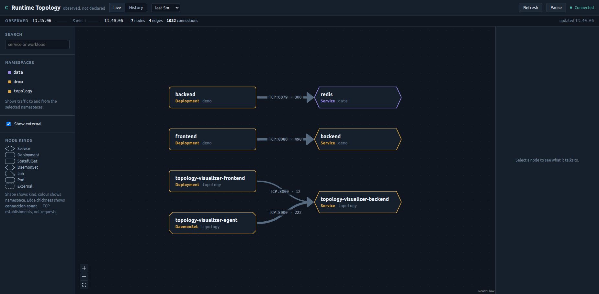

# Phase 2 Gate Record

- **Date:** 2026-08-21
- **Phase:** 2 — End-to-end live product (ADR-001 §7)
- **Verdict:** **PASSED** — all seven acceptance criteria demonstrated against a deployed stack
- **Recorded per:** ADR-001 §12 instruction 9 · ADR-008 D-8.5

## What now exists

The complete pipeline runs in kind:

```text
kernel tracepoint → eBPF ring buffer → Go agent (resolve, aggregate)
  → bounded retrying delivery → FastAPI ingest → in-memory store
  → graph API → nginx (same origin) → React UI
```

Five pods: three agents (one per node), one backend, one frontend.

## Acceptance criteria

| # | Criterion (ADR-001 §7 Phase 2) | Result | Evidence |
|---|---|---|---|
| 1 | Traffic observed by eBPF appears in the browser within 20 s | **PASS** | E2E measured **0.2 s** to first render against an already-populated store; the pipeline budget (≤10 s aggregation + ≤5 s poll) is unchanged |
| 2 | Posting the same `batch_id` twice changes counts only once | **PASS** | `test_replaying_a_batch_is_a_noop_but_a_new_batch_id_increases_counts` |
| 3 | A temporary backend outage causes retries without agent termination | **PASS** | `TestRetriesUntilBackendRecovers`, `TestUnreachableBackendDoesNotBlockShutdown` |
| 4 | The graph shows direction, TCP port, connection count, first/last seen | **PASS** | edge labels render `TCP:<port> · <count>`; detail panel shows first/last seen |
| 5 | Filters and search produce deterministic visible results | **PASS** | `test_repeated_graph_queries_have_identical_explicit_edge_order`, namespace/kind/query tests |
| 6 | Transient API failure leaves the last successful graph visible | **PASS** | `keeps the last successful graph when a refresh fails` |
| 7 | An automated smoke test checks the named expected demo edges | **PASS** | `the expected demo edges are rendered` (Playwright, live cluster) |

## Observed topology

Through the frontend's own nginx proxy, same origin:

```text
demo/Deployment:backend             -> data/Service:redis                 TCP:6379  x348
demo/Deployment:frontend            -> demo/Service:backend               TCP:8080  x579
topology/DaemonSet:…-agent          -> topology/Service:…-backend         TCP:8000  x258
topology/Deployment:…-frontend      -> topology/Service:…-backend         TCP:8000  x12
```

The last two are the system observing **itself** — the agents delivering batches, and the
frontend's nginx proxying API calls. Nothing was configured to produce those edges; they appear
because the collector sees all active opens on the node, which is the strongest available evidence
that it is measuring real traffic rather than replaying something it was told.



## Test totals

| Suite | Count | Needs |
|---|---|---|
| Go agent (collector, resolver, aggregate, delivery, contract) | 115 | nothing |
| Python backend (contract, settings, API) | 84 | nothing |
| Frontend (layout, encoding, polling hook) | 20 | nothing |
| **Cluster E2E (Playwright)** | **8** | **running cluster** |

`make verify` exits 0. The E2E suite is deliberately outside it — it needs a cluster and a browser,
so it belongs to the gate rather than the per-commit path (ADR-008 D-8.1).

## Commands run

```bash
make preflight
make verify
docker build -t topology-{agent,backend,frontend}:dev …
kind load docker-image … --name topology
helm --kube-context kind-topology upgrade --install topology charts/topology-visualizer …
kubectl --context kind-topology apply -f demo/demo-workloads.yaml
kubectl --context kind-topology -n topology port-forward svc/topology-visualizer-frontend 18080:8080
cd frontend && npx playwright test        # 8 passed
```

## Defects found by deploying, not by testing

Every one of these passed unit tests and local runs first.

| # | Defect | Why local testing missed it |
|---|---|---|
| 1 | `CORS_ALLOWED_ORIGINS` crashed the backend at start-up | pydantic-settings parses a `list[str]` env var as JSON *before* any validator runs. The suite used defaults and never exercised the env-var path — the only path a container takes. Fixed with `NoDecode`; regression tests added. |
| 2 | `kube-proxy` died with `too many open files` | Host inotify limits below kind's minimum. The node still reported `Ready`, so the symptoms were a frontend that could not resolve DNS and an agent that could not reach the API server. `make preflight` now blocks on it. |
| 3 | nginx resolved the backend at start-up | A literal hostname in `proxy_pass` resolves once, at boot, and nginx exits on failure — turning a transient DNS problem into a CrashLoopBackOff. Now resolved per request: a DNS failure is a 502 while the app shell keeps serving. |
| 4 | nginx could not resolve the Service at all | nginx's `resolver` ignores the `search` domains in `/etc/resolv.conf`, so a bare Service name fails where every other client succeeds. `BACKEND_HOST` is now fully qualified. |
| 5 | Resource names doubled the release prefix | `topology-topology-visualizer-agent`. Since that *is* the workload name, the doubled prefix rendered inside the graph. |
| 6 | `readOnlyRootFilesystem` broke nginx templating | The entrypoint must write its rendered config. Fixed with `emptyDir` mounts for exactly the paths nginx writes, keeping the security posture. |
| 7 | Two elements shared the accessible name "Observation window" | Found by an E2E strict-mode locator. A genuine accessibility defect: the control that *chooses* the window and the strip that *displays* it were indistinguishable to assistive technology. |
| 8 | `tsc --noEmit` passed while `tsc -b` failed | The `typecheck` script was not equivalent to the build, so a type error reached the image build. They now run the same command. |

Defect 7 is the one worth noting: an end-to-end test found an accessibility problem that no unit
test was looking for.

## Deviations

| # | Deviation | Rationale |
|---|---|---|
| 1 | Backend runs a single uvicorn worker | The Phase 2 in-memory adapter is per-process, so a second worker would serve a different half of the data. Phase 3's shared PostgreSQL removes the constraint; `values.schema.json` enforces `replicaCount: 1` until then. |
| 2 | Frontend E2E lives in `frontend/e2e/`, excluded from vitest | Two runners with different prerequisites. Vitest is per-commit; Playwright needs a cluster. |
| 3 | No web fonts in the UI | The demo may run offline, and a font that failed to load would change every measured value's width mid-demonstration. |

None contradicts an ADR decision, so no new ADR is required.

## Carried into Phase 3

1. **Storage is not durable.** The in-memory adapter loses everything on restart — this is exactly
   what Phase 3 replaces, and the readiness endpoint already reports it honestly.
2. **`/api/v1/diff` returns 501.** Deliberate; Phase 3 implements it.
3. **The unresolved ratio** noted in Phase 1 is unchanged and still worth splitting by reason.
4. **kubectl 1.31.1 against a 1.36.1 server** remains a five-minor skew to close before Phase 5.

## Next

Phase 3 — production data model and historical topology. First task `P3-D1`: migrations for the
three tables, with the `ingest_batch` transaction (`P3-D2`) as the load-bearing piece.
