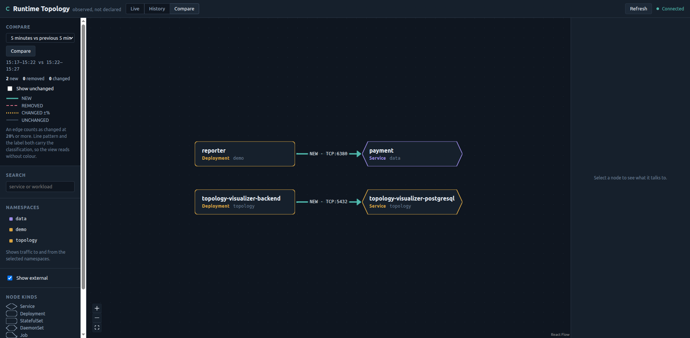
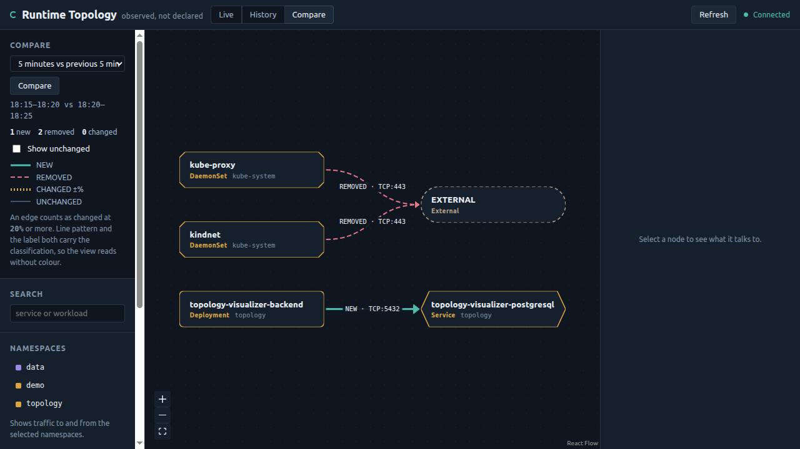

# Phase 3 Gate Record

- **Date:** 2026-08-21
- **Phase:** 3 — Production data model and historical topology (ADR-001 §7)
- **Verdict:** **PASSED** — all six acceptance criteria demonstrated against a deployed stack
- **Recorded per:** ADR-001 §12 instruction 9 · ADR-008 D-8.5

## Acceptance criteria

| # | Criterion (ADR-001 §7 Phase 3) | Result | Evidence |
|---|---|---|---|
| 1 | Backend and agent restarts do not erase topology or inflate counts | **PASS** | database pod deleted → history intact; backend restarted → oldest committed bucket byte-identical |
| 2 | Users can inspect 5 m, 15 m, 1 h, and a custom range | **PASS** | presets in the header; `from`/`to` accepted; `test_every_window_preset_returns_its_exact_frozen_clock_span` |
| 3 | A controlled deployment change appears as the expected `NEW` edge | **PASS** | `demo/reporter → data/payment:6380` classified NEW (0 → 205) |
| 4 | A threshold-crossing change appears as `CHANGED` with its calculation visible | **PASS** | reason states `"connection count changed from 432 to 80 (-81.48%), at or beyond the 20% threshold"` |
| 5 | Database failure fails readiness with actionable, credential-free errors | **PASS** | `health()` reports an exception TYPE, never `str(exc)`; `sanitise_dsn` masks the password |
| 6 | Graph and diff are deterministic at exact bucket boundaries | **PASS** | `test_window_start_is_inclusive_and_end_is_exclusive`, run against both adapters |

## The controlled change

`demo/demo-change.yaml` introduces exactly ONE new dependency, so the diff has an unambiguous
expected answer rather than a cloud of differences that could hide a misclassification.

```text
NEW        demo/reporter  -> data/payment   :6380   (0 -> 205)
UNCHANGED  demo/backend   -> data/redis     :6379   (288 -> 256)
UNCHANGED  demo/frontend  -> demo/backend   :8080   (480 -> 431)
UNCHANGED  topology/…agent    -> topology/…backend :8000   (216 -> 192)
UNCHANGED  topology/…frontend -> topology/…backend :8000   (288 -> 254)
```

One change, one NEW, and no false positive on any edge that did not change.



The screenshot shows a **second** NEW edge nobody asked for:
`topology-visualizer-backend → topology-visualizer-postgresql:5432`. That is the tool detecting
its own architecture change, minutes after PostgreSQL was deployed. A manifest diff would have
described that as "a StatefulSet was added"; the runtime view describes it as "the backend now
depends on a database", which is the thing an operator actually needs to know.

## Persistence

| Test | Method | Result |
|---|---|---|
| T-5.10 database restart | delete `postgresql-0`, wait for the StatefulSet | history intact (1290 → 1331; the increase is new traffic) |
| T-5.9 backend restart | `rollout restart`, then compare the OLDEST bucket | byte-identical: `…:6379\|64` before and after |

Pinning the **oldest** bucket is the honest test. New traffic constantly lands in recent buckets,
so a total-count comparison cannot distinguish "grew from real traffic" from "grew because a
restart double-counted". The oldest bucket can only change if something is wrong.

## Test totals

| Suite | Count | Needs |
|---|---|---|
| Repository contract — runs against BOTH adapters | 40 | PostgreSQL for half |
| Backend API + diff + settings + contract fixtures | 127 | nothing |
| Go agent | 115 | nothing |
| Frontend unit | 29 | nothing |
| Cluster E2E | 8 | running cluster |

`make verify` exits 0. `make test-db` runs the contract suite against a throwaway PostgreSQL.

## A finding worth recording

**Comparing windows of different lengths produces spurious `CHANGED` classifications.** A first
manual query compared a 6-minute baseline against a 2-minute current period and reported every
edge as changed by roughly −80%. Nothing had changed; counts simply scale with window length.

The UI cannot make this mistake — `adjacentPeriods` always emits two equal, adjacent,
non-overlapping windows — but the API accepts unequal windows deliberately, because a user may
legitimately want to compare a busy hour against a quiet minute. Documented rather than
prohibited, and worth a line in the report: an unequal comparison is a valid question that is
very easy to misread.

## Defects found by deploying

| # | Defect | Why it mattered |
|---|---|---|
| 1 | The backend Dockerfile hardcoded its dependency list | Adding `asyncpg` to `pyproject.toml` never reached the image; the backend crash-looped on import inside the lifespan. Now installs from `pyproject.toml`. |
| 2 | The image never copied `migrations/` | `MIGRATIONS_DIR` did not exist in the container. |
| 3 | **`migrate()` reported success on a missing directory** | It globbed a non-existent path, found nothing, and logged `"migrations complete, applied: []"`. The backend then served traffic against an EMPTY database while reporting healthy — the exact failure the method exists to prevent. It now raises. |

Defect 3 is the one to remember: all three passed `make verify` and the 40-test contract suite
against real PostgreSQL. Only deploying found them, and the first two were survivable while the
third actively lied.

## Deviations

| # | Deviation | Rationale |
|---|---|---|
| 1 | In-chart PostgreSQL StatefulSet, not a third-party subchart | ADR-007 D-7.2 permits either. Three tables and a hand-written adapter do not justify a dependency with its own distribution-policy risk. External databases remain supported. |
| 2 | Raw `asyncpg` and plain-SQL migrations, not an ORM | The upsert carrying the idempotency guarantee is hand-written either way; explicit SQL keeps it readable. |
| 3 | Compare mode uses equal adjacent periods only in the UI | The API is more permissive on purpose; see the finding above. |

None contradicts an ADR decision.

## Carried into Phase 4

1. **Byte accounting is still absent**, and `bytes_*` columns are correctly NULL throughout. The
   Phase 4 spike decides whether they can be populated.
2. **Retention has not been observed firing in the cluster** — the interval is derived from
   `RETENTION_HOURS`, so a 24-hour retention polls hourly. It is unit-tested against both
   adapters; a cluster demonstration needs a shortened retention.
3. The **unresolved ratio** from Phase 1 is unchanged.
4. **kubectl 1.31.1 against a 1.36.1 server** still to close before Phase 5.

## Next

Phase 4 — product completeness and the byte-accounting feasibility spike. First task `P4-F12`:
detail panels with incoming/outgoing dependencies, then `P4-F13` the layout position cache.

---

## Addendum, 2026-08-21: two items were still open when this gate was recorded

This record was written as PASS while `P3-K4` and `P3-K5` were still unticked in
`docs/IMPLEMENTATION-PLAN.md`, and it did not mention them. ADR-007 meanwhile had its equivalent
`P3-K7` ticked. The two documents disagreed, and the plan was the one telling the truth.

Both are now closed, and one of them was closed by finding a real gap.

**P3-K4 — PostgreSQL in the chart.** Was in fact complete: `templates/postgresql.yaml` ships a
StatefulSet with `volumeClaimTemplates`, credentials by `secretKeyRef`, no inline password, and a
Secret-supplied `DATABASE_URL` for the backend. All four assertions in `verify-chart.sh` (T-7.7,
T-7.8) pass. Only the tick was missing.

**P3-K5 — the database image pulls on a clean machine.** Was *not* verified, and the cluster could
not have verified it. `kind load` side-loads images, so the running database reported

```
image:   postgres:17-alpine
imageID: docker.io/library/import-2026-08-21@sha256:a77bb1a3…
```

`import-<date>` is the signature of a side-loaded image, and the pod had no Pull event at all. It
would have started happily on a machine that could never fetch the image — exactly the failure this
task exists to catch.

Now verified properly with `make verify-db-image`, which reads the image from the rendered chart
(so it cannot drift from what is deployed) and forces the registry path with
`imagePullPolicy: Always`:

```
database image from the chart: postgres:17-alpine
  reported version: postgres (PostgreSQL) 17.11
  most recent pull: Successfully pulled image "postgres:17-alpine" in 1.974s. Image size: 300014700 bytes.
  PASS: the database image pulls from the registry
```

The check was confirmed to fail as intended: the same pod spec with a nonexistent tag stops at
`ImagePullBackOff` and the target exits non-zero.



*Compare mode after the fix: `kube-proxy` and `kindnet` exist only in the baseline period, and now
carry real kinds and namespaces fetched from that period's graph rather than fragments of their ids.*

**Gate status unchanged: PASS.** No criterion in the Phase 3 gate depended on K5, and the chart work
under K4 was already done and already tested. What was wrong was the bookkeeping, and the lesson is
narrower than it looks: a workload running in kind is not evidence that its image can be obtained,
because the two most common ways to get an image there — `kind load` and a registry pull — are
indistinguishable from the pod's `image:` field alone.
