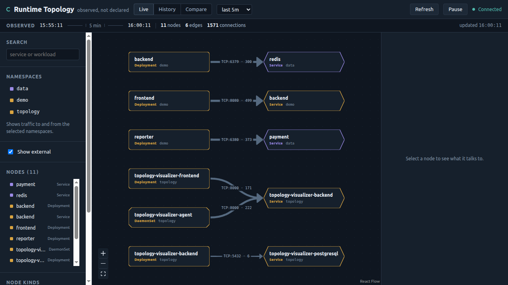

# Phase 4 gate — product completeness and traffic-volume feasibility

**Task:** P4-T11
**Date:** 2026-08-21
**Cluster:** `kind-topology`, 3 nodes, kernel 6.8.0-136-generic
**Gate (ADR-001 §7):** usable at 1280×720 · keyboard reachable · comparison readable without colour ·
thickness uses a named metric · byte decision backed by a reproducible experiment · detail views
complete · frontend tests in CI.

## Result: PASS

Every gate criterion met. The byte-accounting question was answered with a measurement and the
answer was **no** — recorded in `byte-accounting.md`, which ADR-002 D-2.8 explicitly permits.

## Criteria

| # | Criterion | Evidence | Status |
|---|---|---|---|
| 1 | Usable at 1280×720 | No horizontal or vertical scrollbar, no element overflowing the viewport, all 11 nodes fully visible | PASS |
| 2 | Keyboard reachable | 43 interactive elements, all named, zero positive tabindex, focus ring 2px at 6.5–7.18:1 | PASS |
| 3 | Comparison readable without colour | Diff encodes shape and label as well as hue (Phase 3, `diffEncoding.ts`) | PASS |
| 4 | Thickness uses a named metric | Legend: "Edge thickness shows **connection count** — TCP establishments, not requests" | PASS |
| 5 | Byte decision backed by an experiment | 5 privileged experiments, `make spike-bytes`, decision recorded | PASS |
| 6 | Detail views complete | Incoming/outgoing dependencies with protocol, port, count, first/last seen | PASS |
| 7 | Frontend tests in CI | 41 component tests; CI now asserts the executed count | PASS |

## Accessibility: 23 real failures found and fixed

The pass was run against the live cluster UI at 1280×720, computing true WCAG ratios for every
visible text element rather than inspecting by eye.

**Before:** 23 of 79 text elements below AA. Every one traced to a single token, `--text-faint`
(`#6b7f96`), which measured **4.41 / 3.99 / 3.58** against `--ink` / `--panel` / `--panel-high` —
failing on all three. It was used for section labels, panel hints, the observation strip, and the
namespace line on every node, so the defect was spread across the whole interface while looking
deliberate.

**Fix:** `--text-faint` → `#8092a5`, raising lightness while holding hue and saturation, giving
**5.69 / 5.15 / 4.61**. `--text-faint` stays clearly dimmer than `--text-dim`, so the visual
hierarchy is unchanged.

**After:** 0 failures across 103 text elements; the tightest passing ratio is 5.15:1.



This is now enforced in two places, because each catches what the other cannot:

- `frontend/tests/contrast.test.ts` (12 tests) computes ratios from `tokens.css` itself, so a bad
  token fails the build. Verified by reinstating `#6b7f96`: exactly 4 tests fail.
- `frontend/e2e/accessibility.spec.ts` (4 tests) audits the rendered page, catching a component
  that hardcodes a colour rather than using a token. Verified by injecting a 1.20:1 element into
  the live page: caught, and clean again once removed.

The canvas also needed a keyboard equivalent — a React Flow surface cannot be driven by keyboard
alone — so `NodeList.tsx` provides a focusable, Enter-activatable list of every node. It is
deliberately visible rather than screen-reader-only: a hidden accessibility path is one nobody
tests, so it rots.

## Byte accounting: declined, with evidence

Full record in [`byte-accounting.md`](./byte-accounting.md). Summary:

- The tracepoint carries no byte counts, as ADR-002 D-2.8 predicted.
- A cheaper source than the predicted per-packet kprobes exists: `tcp_sock.bytes_sent` /
  `bytes_received`, read once at close on the tracepoint already attached.
- The numbers are **exact** — 65,536 and 4,096 bytes reported with zero delta.
- But they are only readable at close. **8 persistent connections carried 32.3 MB and contributed
  nothing to the window.** Short-lived HTTP measured 99.4% coverage; persistent connections ~0%.
- Since persistent connections are usually the busiest edges, byte-weighted thickness would draw
  the heaviest edges as the faintest. Declined.
- `connection_count` remains the edge weight. No contract or schema change.

An early run reported 151.3% coverage. That was a measurement artifact — the close handler was
counting the server side of connections whose client side was never recorded — fixed with an LRU
socket-pointer map and re-measured at 98.1%. Recorded because the corrected number is the one the
decision rests on.

## Defects found and fixed this phase

1. **23 WCAG AA contrast failures** from one token — above.
2. **CI could pass with zero frontend tests.** The job used `npm test --if-present` inside an
   `if [ -f package.json ]` guard whose else-branch printed "not scaffolded yet" and exited 0.
   Renaming the `test` script would have left the job green while running nothing. Both guards
   removed; a step now asserts the executed test count (41 today, floor of 20).
3. **`make lint-frontend` / `make test-frontend` masked failures.** The same
   `cmd || echo "not scaffolded yet"` shape — the third occurrence of this bug class in the repo.
   A real lint or test failure took the `||` branch and exited 0. Now they assert and fail.
4. **`/favicon.ico` 404 on every page load.** Added `public/favicon.svg`.

## Commands run

```
# byte-accounting experiments (privileged, against the live cluster)
make spike-bytes
  PASS TestPrivilegedByteAccountingAccuracy            (0 delta on 65536 / 4096 bytes)
  PASS TestPrivilegedCountersAreCumulativePerConnection (10240 = 10240)
  PASS TestPrivilegedOpenConnectionReportsNothing       (open connection reports nothing)
  PASS TestPrivilegedWindowCoverage                     (99.4% on short-lived HTTP)
  PASS TestPrivilegedPersistentConnectionCoverage       (32.3 MB invisible)
  ok  .../internal/spike  83.774s

# agent
go build ./...                     exit 0
go test ./... -count=1             ok (aggregate, collector, contract, delivery, resolver)
golangci-lint run ./...            0 issues

# frontend
npm run typecheck                  exit 0   (tsc -b)
npm run lint                       exit 0
npm test                           41 passed (4 files)
npm run build                      exit 0

# end to end, against the redeployed cluster image
npx playwright test                8 passed   (topology.spec.ts)
npx playwright test e2e/accessibility.spec.ts
                                   4 passed
```

## Notes carried forward

- The frontend image is built by the new `make image-frontend`; `make image-backend` was added
  alongside it. Phase 5 still owes a single `make demo-up` that ties the whole stack together.
- `@types/node` was added as a dev dependency. The contrast test reads `tokens.css` from disk
  because vitest stubs CSS imports — `import "...tokens.css?raw"` silently yields an empty string,
  which would have made every assertion throw "token not found" instead of checking a colour.
